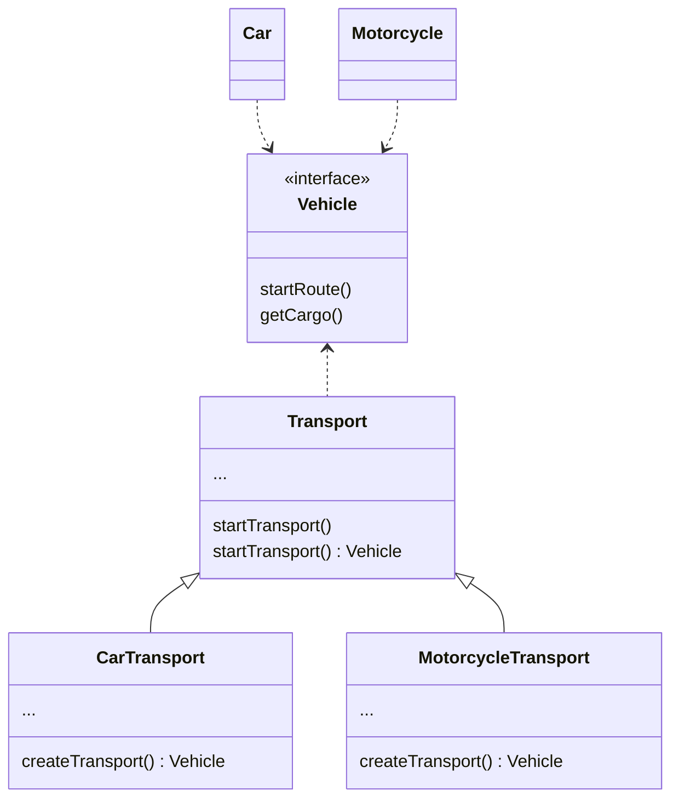

# Design Patterns em TypeScript | Entendendo Padrões de Projetos

## O que é Design Pattern
É como uma solução para um problema recorrente que nós vemos 
no nosso código.

## Princípio SOLID
Esses princípios foram definidos pelo autor Robert Martin.

### [S] SRP - Single Responsibility Principle 
"Nunca deve haver mais de um motivo para uma classe mudar."

### [O] OCP - Open Closed Principle
"Aberto para extensão e fechado para modificação."

### [L] LSP - Liskov Substitution Principle
"Uma classe derivada pode ser substituível por sua classe base."

### [I] ISP - Interface Segregation Principle
"Classes não devem ser forçadas a depender de métodos que não usam"

### [D] DIP - Dependency Inversion Principle
"Módulos de alto nível não devem depender de módulos de baixo nível. Ambos devem depender de abstrações; Abstrações não devem depender de detalhes"

## Design Patterns - A Origem
Tudo começou quando, Christopher Alexander - Urbanista e engenheiro civil austríaco, escreveu dois livros falando sobre design pattern
- A Pattern Language (08/1977)
- A Timesless Way of Building (08/1979)

Alexander escreveu esses livros pensando na construção de prédios, mas os padrões que ele notou, podem ser aplicados também a arquitetura de software/desenvolvimento de software

Características de um Padrão:
- Encapsulamento
- Generalidade
- Equilíbrio
- Abstração
- Abertura
- Combinatório

Christopher Alexander escreveu que um padrão de projeto basicamente descreve um problema que ocorre várias vezes no nosso ambiente de desenvolvimento e ele também descreve como podemos resolver aquela questão e deixa isso registrado, para que possamos lembrar de como fizemos aquilo, para não ter que ficar repetindo a mesma solução mais de uma vez.

## Gangue dos Quatro - Gang of Four (Gof)
A "Gangue dos Quatro" são quatro desenvolvedores, que se jutaram e escreveram um livro mundialmente conhecido, o Design Patterns - Elements of Reusable Object-Oriented Software - 1995
Esses quatro desenvolvedores são: Erich Gamma, Richard Helm, Ralph Johnson, John Vlissides
Dentro desse livro, eles documentaram certa de 23 padrões de projeto

## Por que utilizar Design Pattern
"Não reinventar a roda"
Aprenda a reconhecer um padrão, e a implementá-lo. É como conhecer bem uma ferramenta específica, muitas vezes você não precisará dela, mas quando precisar, você saberá.

"Melhora a Comunicação"
Os padrões possuem nome, tem situações em que ocorrem, e resolvem problemas específicos, quando aplicados melhoram a comunicação entre a equipe.

"Alavancar sua carreira profissional"
Os engenheiros de software bem como os arquitetos de software precisam conhecer bem os padrões de projeto e saber onde aplicá-los.

## Padrão Criacional, Estrutural e Comportamental
### Criacional
Trabalham com a criação de objetos flexíveis e reutilizáveis.
 
### Estrutural
Definem como trabalhar com objetos e classes em estruturas maiores e complexas, e ainda assim flexíveis e eficientes.
 
### Comportamental
Trabalham com a comunicação eficiente e designam as responsabilidades comuns aos objetos.

## Design pattern - Criacional
**Factory Method**

